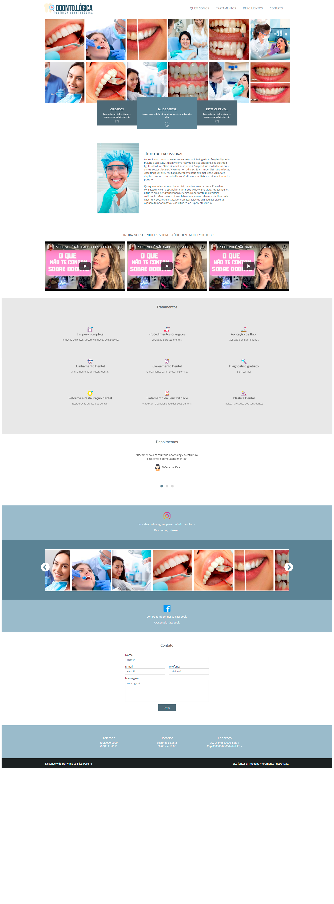
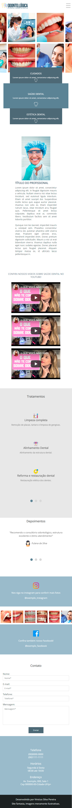
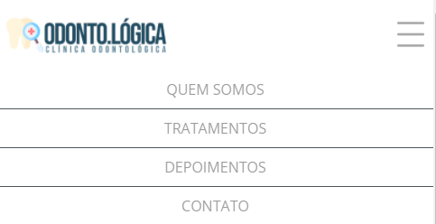

# Odonto.Lógica - Consultório Odontológico
## Sobre o Projeto 
o Projeto teve como finalidade aplicar novas tecnicas aprendidas durante o curso de Front End da Danki Code em uma página fantasia. Nesse projeto apliquei conceitos de design responsivo utilizando elementos de "DISPLAY FLEX", Sliders automaticos feitos em JQuery, sessão de "tratamentos e depoimentos" com Bullet Sliders automaticos e clicaveis, assim como uma sessão de fotos com o uso do framework JS "Slick", que permite criar sliders automaticos de maneira maneira mais rápida com poucas linhas de código. 

## Desktop Viewport 

## Mobile Viewport 

## Mobile Menu 

